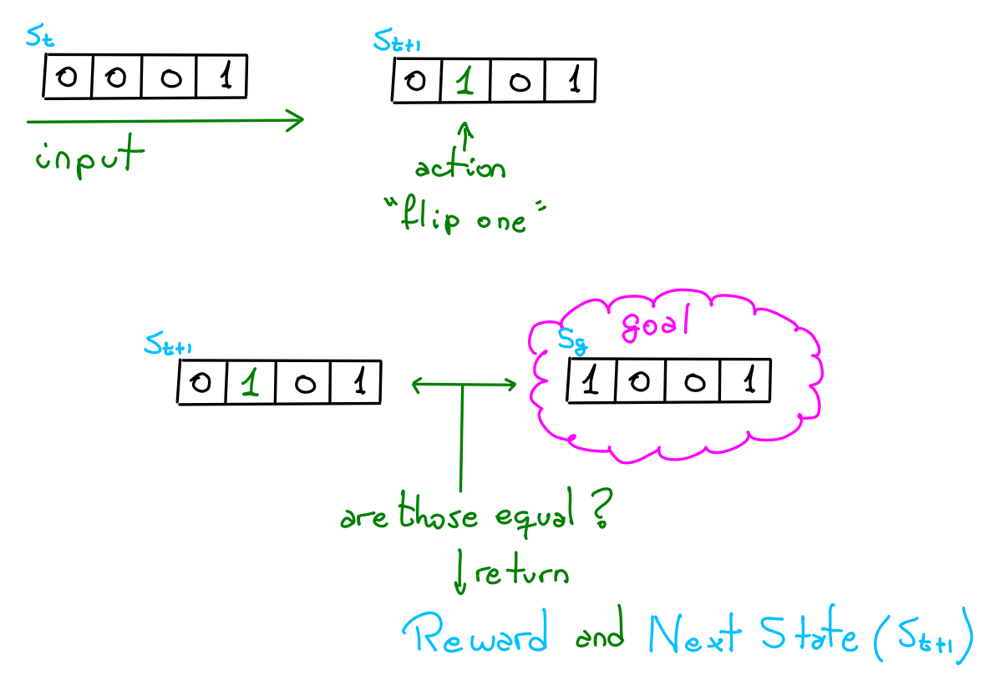

# CS 330: Deep Multi-Task and Meta Learning
https://cs330.stanford.edu/

## Step by Step notebook problem solving

1. **Hw1: Meta Learning on Omniglot**

   Dataset organization, training, 
   
   [Notebook 1](<./hw1/Homework 1 - Step by step.ipynb>)
   
2. **Hw2:**
   
   [folder 2](<./hw2/>)

3. **Hw3: Goal Conditioned Reinforcement Learning & Hindsight Experience Replay**

   Simple RL agent + task id on two environment: Flip bits and 
   
   [Notebook 3](<./hw3/Hw3 - Goal Conditioned RL & Hindsight Experience Replay - Step by step>)
   
   
